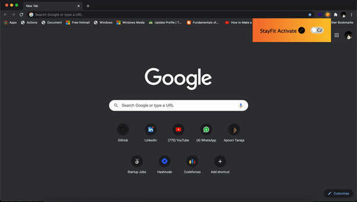

# StayFit - Chrome Extension

As we know Software Engineers spend a lot of time on Laptops which affect their body posture. This extension will remind you every in **60 minutes** to move your body and improve your sitting posture.

## Demo

## Steps to Install
1. Clone this repository.
2. Navigate to chrome://extensions/
3. Toggle the developer mode (Activate it).
4. Click on 'Load Unpacked'
5. Select the complete folder which you cloned in the first step.

## Tech Stack
- HTML
- CSS
- JavaScript
- Chrome Extension API